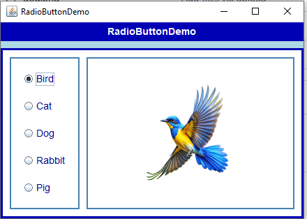
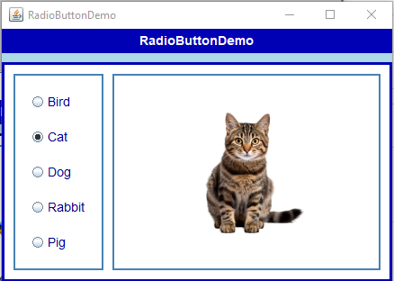

# RadioButtonDemo - Java Assignment 2

A Java Swing application that uses five radio buttons to select and display a pet image.

## Features
- 5 radio buttons: Bird, Cat, Dog, Rabbit, Pig
- Displays selected pet image
- Shows message box with selected pet name
- Blue styled borders and UI

## Screenshots

### App Window

### Message Box

## How to Run
1. Install Java JDK from https://www.oracle.com/java/technologies/downloads/
2. Open terminal in project folder
3. Compile:
javac RadioButtonDemo.java
4. Run:
java RadioButtonDemo

## Source Code
See `RadioButtonDemo.java` in this repository.
